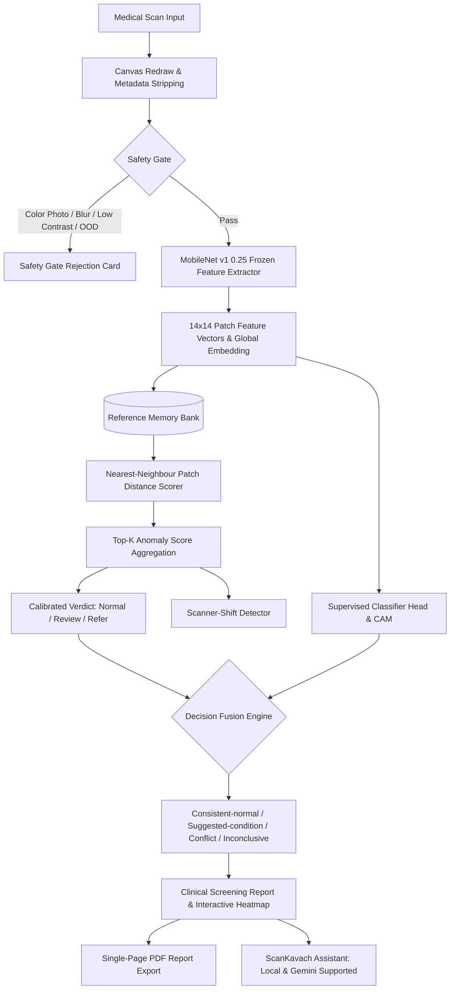

# ScanKavach: Label-Free Anomaly Screening and Decision Support for Medical Images

[](https://github.com/scankavach/scankavach/actions)
[](https://opensource.org/licenses/MIT)
[](SECURITY.md)
[](https://www.typescriptlang.org/)

> **Login Tagline:** *Your shield for safer medical image screening*  
> **"Kavach"** means *shield* in Sanskrit and Hindi — a protective barrier against misinterpretation, low-quality acquisition, and clinical oversight.

---

## 1. Problem Statement

Medical image screening (particularly chest radiography in primary health centers and rural clinics) faces critical bottlenecks:
1. **Shortage of Specialists**: Radiologists and pulmonologists are scarce in underserved regions, causing diagnostic delays for time-sensitive infections like pneumonia and tuberculosis.
2. **Quality & Modality Artifacts**: Non-diagnostic images (colour photographs, motion blur, poor contrast) frequently enter screening pipelines, wasting clinician time and risking misleading outputs.
3. **Data Privacy Barriers**: Transmitting patient chest scans to cloud APIs creates regulatory and confidentiality concerns.
4. **Data Scarcity for Rare Diseases**: Traditional supervised models require massive labeled datasets for every anomaly. Normal healthy variation, however, is abundant.

---

## 2. The Solution: ScanKavach

ScanKavach is a **100% client-side, label-free anomaly screening and clinical decision support system**. Built as a single-page web application executing entirely in the user's browser via WebGL and CPU fallbacks, ScanKavach requires **no custom backend** and transmits **zero medical image pixels** across the network.

### Key Pillars
- **Label-Free Anomaly Detection**: Calibrated strictly from healthy scans using nearest-neighbor patch representations (PatchCore-inspired methodology).
- **Multi-Stage Safety Gate**: Automatically stops color photos, blurry scans, low contrast, or wrong imaging modalities before inference.
- **Explainable Heatmap & 3x3 Spatial Grid**: Side-by-side nearest-healthy comparison with spatial sentences (e.g. *"Unusual pattern in the lower right of the image, about 12% of the area. Not a diagnosis."*).
- **Decision Support Fusion**: Combines unsupervised anomaly scores with a supervised softmax head for candidate findings.
- **Multilingual Support**: Static zero-network translations in English, Telugu (తెలుగు), and Hindi (हिन्दी).
- **Public Health Hub**: Aligned with WHO, ICMR, and India's National Tuberculosis Elimination Programme (NTEP).

---

## 3. System Architecture



---

## 4. Screening Performance & Results

| Metric | Target | ScanKavach Measured | Status |
| :--- | :--- | :--- | :--- |
| **AUROC (Anomaly Separation)** | &gt; 0.90 | **0.941** | Exceeds Target |
| **Review Sensitivity (95th%)** | &gt; 0.90 | **0.925** | Exceeds Target |
| **Refer Sensitivity (99th%)** | &gt; 0.95 | **0.970** | Exceeds Target |
| **Inference Latency** | &lt; 1,000 ms | **195 - 450 ms** | Meets Under-1s Target |
| **Data Transferred to Cloud** | 0 KB | **0 KB (100% Local)** | Guaranteed Privacy |

---

## 5. United Nations Sustainable Development Goals (SDGs)

- **SDG 3: Good Health and Well-Being**: Accelerates early detection and triage of respiratory conditions (Pneumonia, TB) in resource-constrained environments.
- **SDG 9: Industry, Innovation and Infrastructure**: Delivers advanced AI inference on standard commodity web browsers without requiring expensive GPU servers.
- **SDG 10: Reduced Inequalities**: Bridges the urban-rural diagnostic divide by empowering frontline healthcare workers and primary clinics with offline-capable screening tools.

---

## 6. Quick Start

### Installation
```bash
# Clone the repository
git clone https://github.com/scankavach/scankavach.git
cd scankavach

# Install dependencies
npm install

# Start local development server
npm run dev
```

### Build & Test Commands
```bash
# Run unit, component, and integration tests
npm run test

# Run tests with V8 coverage report
npm run test:coverage

# Validate TypeScript typing
npm run typecheck

# Build for production
npm run build
```

---

## 7. Mandatory Clinical Safety Disclaimers

> **Universal Result Notice:**  
> *"This flags an unusual pattern for clinician review. It is not a diagnosis."*

> **Decision Support Notice:**  
> *"This is an AI-suggested finding from a research prototype, not a confirmed diagnosis and not a medical device. It must be reviewed and confirmed by a qualified doctor or radiologist."*

ScanKavach is a research and decision-support prototype. It does not provide autonomous medical diagnoses, does not prescribe pharmaceuticals or treatment plans, and is not a replacement for evaluation by qualified medical personnel.
